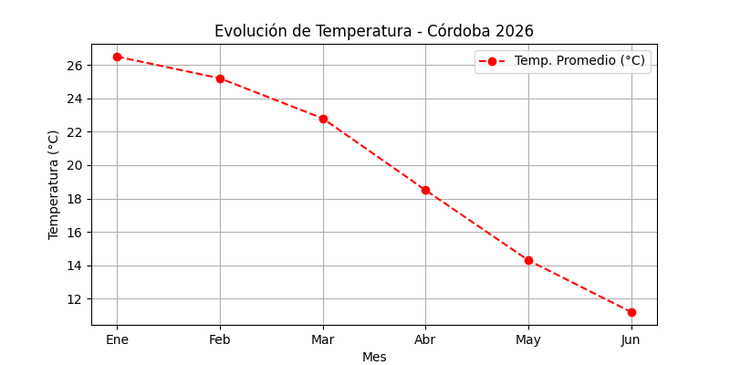

# 📊 Proyecto de Gestión Climática - TUP

Este proyecto contiene la simulación de un sistema de procesamiento y análisis de datos climáticos de la ciudad de Córdoba, desarrollado como trabajo práctico integrador utilizando metodologías ágiles (Jira) y control de versiones (Git/GitHub).

---

## 🚀 Reporte de Trazabilidad (Luis - KAN-4)

A continuación se detalla el historial de tareas integradas en este repositorio, vinculando cada requerimiento del tablero Jira con su respectivo impacto en el código:

### 📋 Tablero de Tareas Jira
* **KAN-1 [Hugo - P1]**: Inicialización de estructura de carpetas (`/scripts` y `/datos`).
* **KAN-2 [Paco - P2]**: Desarrollo de script de análisis climático y generación de gráficos.
* **KAN-4 [Luis - P3]**: Documentación final y generación del reporte de trazabilidad en el repositorio.

---

## 🛠️ Historial de Commits (Git)

| Tarea Jira | Responsable | Descripción del Cambio | Archivos Afectados |
| :--- | :--- | :--- | :--- |
| **`KAN-1`** | Hugo (P1) | Creación de directorios base del proyecto | `datos/clima_placeholder.csv` |
| **`KAN-2`** | Paco (P2) | Creación del script ejecutable, base de datos simulada y gráfico estadístico | `scripts/script_analisis.py`, `datos/registro_climatico.csv`, `datos/grafico_temperaturas.png` |
| **`KAN-4`** | Luis (P3) | Generación del reporte de trazabilidad y cierre del repositorio | `README.md` |

---

## 📈 Resultados del Análisis Climático
El script desarrollado por el equipo procesa las variables de temperatura promedio y precipitaciones mensuales para la región de Córdoba de manera automatizada, exportando reportes visuales listos para auditorías climáticas.

### 📊 Visualización del Gráfico Generado por Paco:

